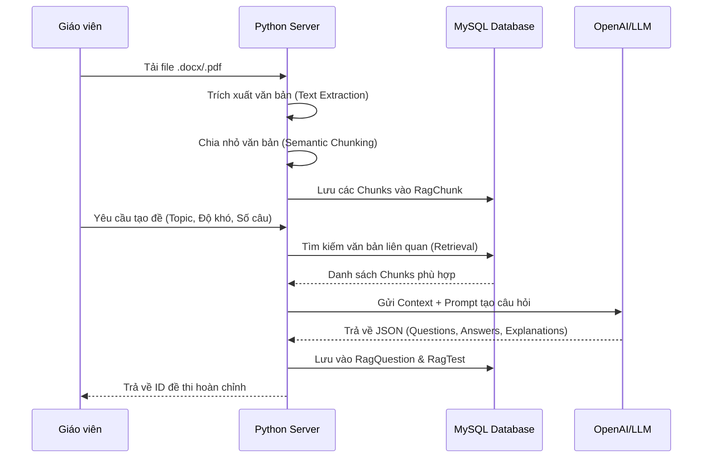
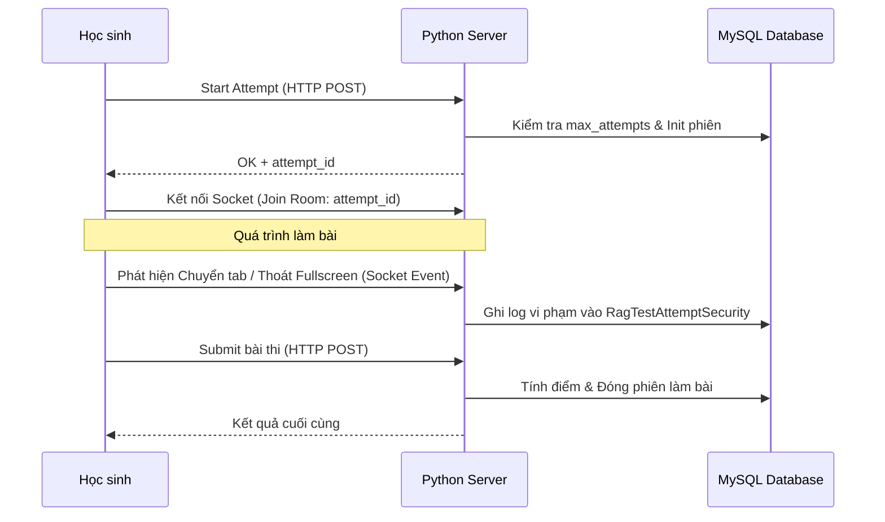
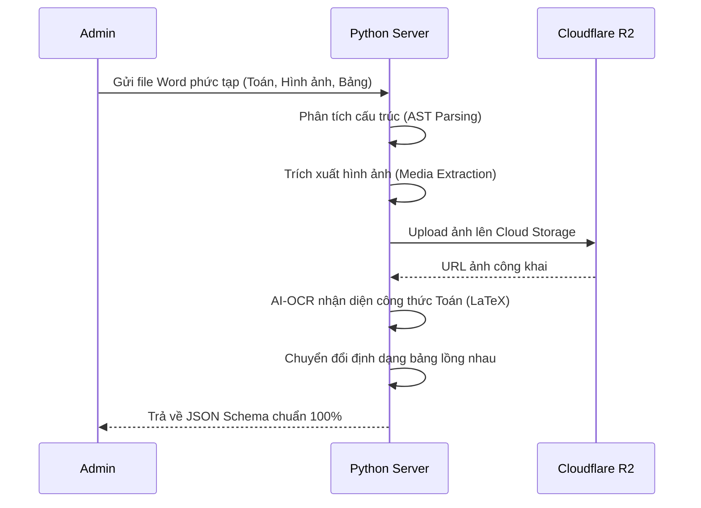

# EduLearn AI Python Server 🚀

## 📌 Tổng quan dự án (Project Overview)
**EduLearn AI Python Server** là hạ tầng Backend chuyên biệt xử lý các tác vụ AI phức tạp cho hệ sinh thái EduLearn. Server được xây dựng trên Flask, đóng vai trò là "bộ não" AI, xử lý các tác vụ nặng về tính toán mà Server NestJS chính không đảm nhận.

---

## 🛠 Luồng hoạt động chính (Core Activity Flows)

### 1. Quy trình tạo đề thi AI (RAG Pipeline)
Hệ thống sử dụng kỹ thuật **Retrieval-Augmented Generation (RAG)** để đảm bảo đề thi bám sát nội dung tài liệu của giáo viên.



### 2. Hệ thống giám sát thi cử Real-time (Anti-Cheat)
Sử dụng **Socket.IO** để duy trì kết nối liên tục giữa Client và Server nhằm phát hiện gian lận ngay lập tức.



### 3. Số hóa tài liệu Word (Digitalization)
Quy trình chuyển đổi tài liệu thô sang cấu hình hệ thống (Structured Data).



---

## 🛡 Kiến trúc Bảo mật chi tiết (Security Deep-Dive)

### 1. Tầng Giao thức (Protocol Level)
*   **Secure Filename:** Sử dụng `werkzeug.utils.secure_filename` để ngăn chặn tấn công chèn mã lệnh qua tên file.
*   **CORS Management:** Chỉ cho phép các Domain được cấu hình trong `CORS_ORIGINS` truy cập vào tài nguyên AI nhạy cảm.

### 2. Tầng Ứng dụng (Application Level)
*   **Transaction Integrity:** Các thao tác tạo đề thi phức tạp được bao bọc trong Transaction. Nếu AI lỗi giữa chừng, hệ thống tự động Rollback dữ liệu trong Database.
*   **Rate Limiting:** (Thiết kế dựa trên khả năng chịu tải của API LLM) Ngăn chặn việc spam yêu cầu tạo nội dung AI liên tục làm cạn kiệt Token.

### 3. Tầng Dữ liệu & AI (Data & AI Security)
*   **SQL Parameterization:** Tuyệt đối không cộng chuỗi SQL. Mọi thao tác đều qua `DatabaseService` với placeholder `%s`.
*   **Prompt Shielding:** Các Prompt gửi lên AI được thiết kế để "Grounding" (ép AI chỉ trả về nội dung dựa trên tài liệu đã có), hạn chế tình trạng AI bị dắt mũi (Hallucination).

---

## 📄 Danh mục API trọng tâm (Key API Reference)

| Endpoint | Method | Chức năng | Security |
| :--- | :--- | :--- | :--- |
| `/ai-exam/create_test` | POST | Tạo đề thi từ tài liệu (RAG) | Validate Doc Extension |
| `/exams/attempt/start` | POST | Kiểm tra lượt làm nốt/lượt mới | Check Max Attempts |
| `/exams/attempt/log` | POST | Ghi nhật ký vi phạm bảo mật | ID Attempt Validation |
| `/digital-document/process`| POST | Số hóa văn bản sang JSON/LaTeX | Secure IO + R2 Upload |
| `/writing-chat-bot/generate`| POST | AI tạo hội thoại luyện viết | CEFR Level Validation |

---

## ⚙️ Hướng dẫn cài đặt & Chạy (Quick Start)

1.  **Clone & Venv:**
    ```bash
    git clone ...
    cd Edu_Learn_Python_Sever
    python -m venv venv
    source venv/bin/activate
    ```
2.  **Cài đặt Dependencies:**
    ```bash
    pip install -r requirements.txt
    ```
3.  **Cấu hình Environment:**
    Copy file `.env.example` thành `.env` và điền đủ thông tin:
    *   `PORT=5000`
    *   `OPENAI_API_KEY`: Key cho GPT-4o.
    *   `CLIENT_API_URL`: URL Server NestJS để đồng bộ dữ liệu.
4.  **Khởi chạy:**
    ```bash
    python main.py
    ```

---

*Biên soạn bởi Antigravity AI - System Architecture Division.*
